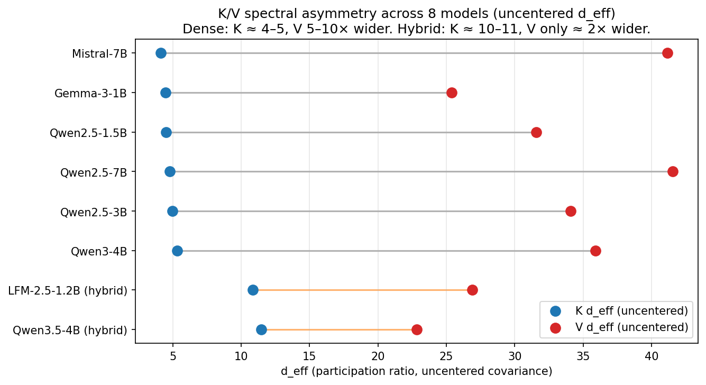

# K/V Asymmetry: Cross-Model Profiling Memo

*aggregate_kv_asymmetry.py output, 8 models, 2048-token wikitext calibration via scripts/spectral_profiler.py.*

## TL;DR

On every model tested, V's effective dimension is greater than or equal to K's — V carries more variance directions than K. The gap is large on dense attention models and much smaller on hybrid (Mamba+Attention / DeltaNet) models. This corroborates the `asymmetric K/V` direction TurboQuant+ has already landed on (`q8_0` keys, `turbo3` values); the refinement worth flagging is that hybrid models need a different policy than dense because their K geometry is genuinely different (K `d_eff_uc` ≈ 10–11 on hybrids vs ≈ 4–5 on dense).

- **Dense models**: V/K uncentered d_eff ratio = 5.7×–10.0× (median 6.9×).
- **Hybrid models**: V/K uncentered d_eff ratio = 2.0×–2.5× only.
- Dense K `d_eff_uncentered` is tightly clustered around 4–5; hybrid K sits at ~10–11 — hybrids do **not** have the single-dominant-direction K structure that makes dense K so compressible.

## Data

8 models profiled per-head, per-layer, on 2048 wikitext tokens of calibration data (post-RoPE K from KV cache). Raw profiles: `profiles/spectral_*.json`. This memo consumes only the summary statistics and per-layer K/V d_eff means; per-head detail is available in the raw files for follow-ups.

## 1. Cross-model K/V spectral summary

`d_eff_uc` (participation ratio of **uncentered** covariance) measures structural concentration including the mean direction. `d_eff_c` (centered) measures variance-around-mean concentration. Asymmetry columns are `V / K` ratios — higher means V is more diffuse relative to K.

| Model | Arch | Attn layers | Heads × dim | K d_eff_uc | K d_eff_c | V d_eff_uc | V d_eff_c | Asym_uc | Asym_c |
|---|---|---:|---:|---:|---:|---:|---:|---:|---:|
| Gemma-3-1B | dense | 26 | 1 × 256 | 4.45 | 25.58 | 25.38 | 51.15 | 5.7× | 2.00× |
| Mistral-7B | dense | 32 | 8 × 128 | 4.13 | 38.70 | 41.19 | 50.49 | 10.0× | 1.30× |
| Qwen2.5-1.5B | dense | 28 | 2 × 128 | 4.51 | 38.03 | 31.57 | 46.13 | 7.0× | 1.21× |
| Qwen2.5-3B | dense | 36 | 2 × 128 | 4.96 | 39.01 | 34.10 | 45.87 | 6.9× | 1.18× |
| Qwen2.5-7B | dense | 28 | 4 × 128 | 4.78 | 37.20 | 41.56 | 51.03 | 8.7× | 1.37× |
| Qwen3-4B | dense | 36 | 8 × 128 | 5.30 | 30.76 | 35.92 | 47.10 | 6.8× | 1.53× |
| LFM-2.5-1.2B (hybrid) | hybrid | 6 | 8 × 64 | 10.86 | 24.97 | 26.91 | 33.09 | 2.5× | 1.33× |
| Qwen3.5-4B (hybrid) | hybrid | 8 | 4 × 256 | 11.46 | 36.64 | 22.84 | 64.69 | 2.0× | 1.77× |

## 2. Boundary-layer behavior (dense models)

Tom's `TurboQuant+` docs flag that first and last layers behave differently. We split each dense model's layers into first-3 / middle / last-3 buckets and report mean K and V centered d_eff. Hybrids have too few attention layers for a meaningful split and are omitted.

| Model | K first3 | K mid | K last3 | V first3 | V mid | V last3 |
|---|---:|---:|---:|---:|---:|---:|
| Gemma-3-1B | 32.8 | 24.2 | 27.8 | 39.7 | 52.4 | 54.2 |
| Mistral-7B | 33.9 | 39.0 | 41.0 | 33.4 | 51.3 | 60.2 |
| Qwen2.5-1.5B | 40.1 | 38.8 | 30.4 | 37.9 | 43.7 | 72.2 |
| Qwen2.5-3B | 27.3 | 40.1 | 39.9 | 34.7 | 45.6 | 59.8 |
| Qwen2.5-7B | 34.7 | 37.6 | 36.9 | 36.8 | 51.3 | 63.5 |
| Qwen3-4B | 21.5 | 31.8 | 29.8 | 31.4 | 47.6 | 57.3 |

**Pattern**: on most dense models V `d_eff_c` grows noticeably in the last 3 layers — V becomes *less* compressible near the output. K is more stable across layers. Implication: V aggression has to taper at the last layers; a flat V policy will cost more quality per saved bit at the tail than at the middle.

## 3. Head-level compressibility distribution

What fraction of K heads are easy targets (d_eff_c < 16) versus stubborn (d_eff_c ≥ 32)? Same for V (using ≥ 40 since V is generally more diffuse).

| Model | K heads w/ d_eff_c < 16 | K heads w/ d_eff_c ≥ 32 | V heads w/ d_eff_c ≥ 40 |
|---|---:|---:|---:|
| Gemma-3-1B | 23% | 27% | 81% |
| Mistral-7B | 1% | 75% | 75% |
| Qwen2.5-1.5B | 2% | 62% | 62% |
| Qwen2.5-3B | 3% | 71% | 56% |
| Qwen2.5-7B | 1% | 69% | 74% |
| Qwen3-4B | 6% | 42% | 65% |
| LFM-2.5-1.2B (hybrid) | 8% | 17% | 23% |
| Qwen3.5-4B (hybrid) | 0% | 66% | 94% |

## 4. Implications for quantization policy

Read this as structural evidence, not as specific bit-width prescriptions — the mapping from `d_eff` to optimal bits depends on the quantizer (uniform, Lloyd-Max, TCQ), the rotation (WHT vs spectral), and the downstream metric (attention cosine, PPL, NIAH).

1. **V bits can be pushed harder than K bits on dense models.** Every dense model has V `d_eff_c` higher than K `d_eff_c`, and uncentered V/K ratios of 6–10×. This is the structural fact behind `q8_0 keys + turbo3 values`.
2. **Hybrid K is a different geometry.** K `d_eff_uc` on LFM-2.5 and Qwen3.5-4B is 10–11 rather than 4–5. The aggressive K compression schemes that work on dense attention will extract less gain from hybrid K, and the V/K asymmetry narrows (2× vs 6–10×). If a codebase is shipping dense policies by default, hybrid models deserve a separate calibration pass or a conservative fallback. TurboQuant+'s `layer-aware-v-compression.md` already caveats that Boundary V currently mis-targets hybrid architectures (e.g. Qwen3.5) because only a subset of layers carry KV attention caches; the different K spectral structure reported here is independent mechanistic evidence that dense-tuned K policy will not transfer cleanly to hybrids.
3. **V needs layer-awareness at the output boundary.** V `d_eff_c` rises in the last 3 layers across dense models (see §2). A uniform-across-layers V bit budget will be more lossy at the tail than at the middle. A one-knob escape hatch ("last N layers get +2 V bits") likely captures most of the quality loss.
4. **Per-head variance is large.** Even on dense Qwen2.5 models, a non-trivial minority of K heads are stubborn (d_eff_c ≥ 32). A per-head bit policy captures real signal that a per-layer policy cannot, but requires metadata overhead. If the codebase is already per-layer, the next rung up is boundary-layer-aware rather than per-head.

## 5. What this memo does not claim

- Nothing here tells you whether spectral rotation beats WHT in production. Our `Bench A` (docs/bench_v2_findings.md) shows SpectralQuant-style variants are not a clear win over TurboQuant under heldout evaluation on Qwen2.5-1.5B. The asymmetric K/V story is orthogonal to that: it's about *bit budget allocation per tensor*, not about *how to quantize a given tensor*.
- Nothing here measures downstream task quality (NIAH, PPL, generation). Head-level d_eff is a structural proxy; the actual bit choice needs an end-to-end metric.
- Only 8 models. No 30B+, no MoE, no vision-language. The dense-vs-hybrid split is real on this sample but the boundary of generalization is not established.

## 6. Suggested follow-ups (ranked)

1. **Cross-check with TurboQuant+'s existing K/V docs before socializing.** The relevant references are `vendor/turboquant_plus/docs/papers/asymmetric-kv-compression.md` (the "V is free, K is everything" case, 7 models, 1.5B–104B) and `layer-aware-v-compression.md` (Boundary V: protect first 2 and last 2 layers, validated on pure-attention phi-4 and Qwen2.5-7B). Align terminology and units before any external writeup. TriAttention V3 is token eviction and is the wrong citation for K/V bit allocation.
2. **Validate the boundary-V hypothesis against Tom's data.** `layer-aware-v-compression.md` protects first-2 and last-2 layers; our §2 data shows V `d_eff_c` rising specifically in the last 3 layers. Two independent signals pointing at the same place. A small overlay — plot our per-layer V `d_eff_c` against his PPL-delta curve from the same model — would tighten the story and is nearly zero new compute.
3. **Cross-check our hybrid finding against MoE results.** Tom has already tested Boundary V on Qwen3.5-35B-A3B MoE (`moe-v-compression-frontier.md`); we have no MoE in our profile set, and MoE ≠ hybrid attention. Extending our profiler to one MoE model (e.g. Qwen3-MoE-A3B or Qwen3.5-35B-A3B) would tell us whether MoE K spectral structure looks dense-like or hybrid-like, and whether Tom's positive MoE Boundary V result is consistent with the `d_eff_uc ≈ 4–5` regime.
