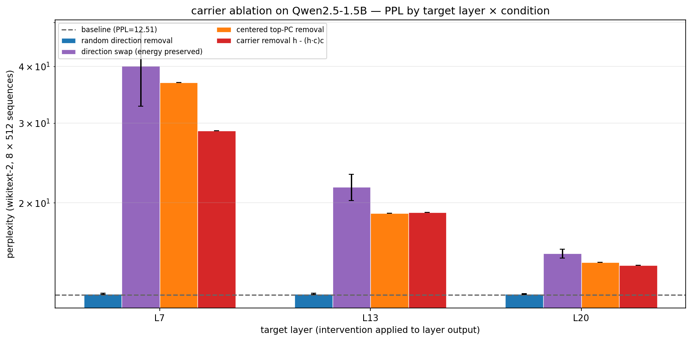
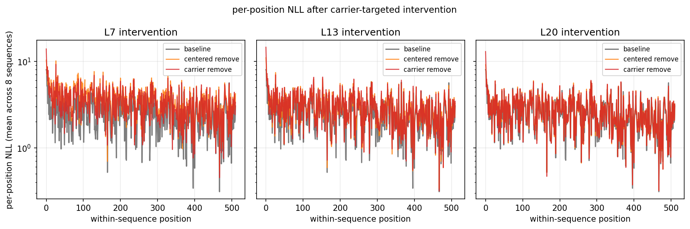

# Causal Ablation: Carrier Is Load-Bearing Infrastructure on Qwen2.5-1.5B

**Status (2026-04-30):** Forward-pass intervention test on Qwen2.5-1.5B. Five conditions × three target layers. Result: the rank-1 carrier subspace is causally load-bearing. Random-direction removal is harmless; carrier removal raises PPL by 2.30× at L7. Direction-swap is even worse than removal (3.20× at L7) — adding random-direction energy in place of the carrier is more destructive than removing the energy entirely.

This is a causal follow-up to the structural cross-model write at `docs/layer_structure_carrier_cross_model.md`. Code: `scripts/ablate_carrier.py`. Output: `results/ablation_qwen25_1.5b.json`. Figures: `docs/img/ablation_*_qwen25_1.5b.png`.

---

## Setup

Qwen2.5-1.5B in fp32 on M5 Max. The same 8 × 512 wikitext sequences saved during the carrier analysis (`results/carrier_structure_qwen25_1.5b.npz`'s `token_ids`). Carrier direction `c` is `V_20[0]` from the same npz: top-1 right singular vector of stacked uncentered L2–L26 activations.

Intervention point: forward hook on the output of transformer block `target_layer`, modifying the residual stream after the block writes its output and before block `target_layer + 1` reads it. This matches the object we analyzed structurally (the residual stream between blocks).

Five conditions per target layer:

1. **baseline** — no hook
2. **carrier_remove**: `h ← h - (h · c) c`
3. **random_remove**: `h ← h - (h · r) r` for random unit `r`. Averaged over 8 seeds.
4. **direction_swap**: `h ← h - (h · c) c + (h · c) r` for random unit `r ⊥ c`. Averaged over 8 seeds. Preserves the carrier coefficient magnitude but redirects it.
5. **centered_remove**: `h ← h - (h · c_c) c_c` where `c_c` is the sign-aligned mean of per-layer top centered eigenvectors across L2–L26.

Targets: L7 (early-middle), L13 (mid-middle), L20 (late-middle).

Response: per-token NLL via standard next-token cross-entropy on the 8 × 512 sequences, aggregated to PPL.

## Results

Baseline PPL: **12.51**.

| Target | random_remove | carrier_remove | direction_swap | centered_remove |
|---|---:|---:|---:|---:|
| L7  | **1.00× (12.58 ± 0.05)** | **2.30× (28.81)** | **3.20× (40.05 ± 7.40)** | **2.94× (36.82)** |
| L13 | 1.00× (12.57 ± 0.04) | 1.52× (19.05) | 1.73× (21.67 ± 1.45) | 1.51× (18.94) |
| L20 | 1.00× (12.57 ± 0.04) | 1.16× (14.56) | 1.23× (15.44 ± 0.35) | 1.18× (14.78) |

Per-position NLL after intervention shows the gap between baseline and carrier-removed conditions opens uniformly across positions, with no position-specific concentration of the failure:

## What this tells us

### 1. The carrier is load-bearing.
2.30× PPL increase at L7 from removing a single direction (out of 1536) cleanly demonstrates that the carrier subspace is not a measurement artifact. Downstream layers actively depend on it.

### 2. The effect is *carrier-specific*, not "any direction matters".
random_remove sits at 1.00× of baseline at every target layer (PPL 12.58 vs 12.51 — well within noise). Removing a random unit direction with random coefficient mass has no measurable downstream effect on perplexity. So the carrier-removal damage is not generic dimension-killing; it's specific to the carrier direction the model has built around.

### 3. Energy in the wrong place is worse than no energy.
direction_swap (3.20× at L7) is **worse than carrier removal** (2.30× at L7). Replacing the carrier component with the same magnitude redirected to a random orthogonal direction breaks the model harder than zeroing the carrier component out.

This rules out the simplest "carrier is just a numerical bias the model learned to subtract" picture. Downstream attention layers must be actively *reading* the carrier direction in a way that's affected by injected noise. Roughly: the model expects the carrier direction's coefficient to look a certain way; replacing that with random-direction noise creates active interference, not just lost signal.

### 4. Earlier middle layers matter more than later middle layers.
Effect monotonically decays with depth: L7 > L13 > L20. There are simply fewer downstream layers to break by the time you reach L20. The carrier is structural infrastructure that the rest of the network builds on.

### 5. Centered top-PC and uncentered carrier are the same direction here.
`alignment(c_uncentered, c_centered) = 1.0000` (exact). Qwen's outlier feature is so extreme that subtracting the position-mean doesn't change the dominant variance direction. So `centered_remove` ≈ `carrier_remove` and the two columns track. This isn't a separate finding — it's a structural fact about Qwen's position-0 sink.

## What this rules in / rules out

Mapping back to the predictions we registered before running:

| Prediction | Outcome |
|---|---|
| "carrier removal catastrophic, controls mild — strongest win" | Mostly. carrier removal is catastrophic (2.30×). random_remove is mild (1.00×). But direction_swap is also catastrophic (3.20×), and centered_remove tracks carrier_remove. |
| "carrier removal and direction-swap both catastrophic — coefficient energy is load-bearing, not just the exact direction" | Stronger version of this: the *direction* matters too. Replacing energy with a wrong-direction copy is *worse* than removing it. |
| "carrier removal and centered-top both catastrophic — dominant low-rank structure generally matters" | Trivially true here because c_uncentered and c_centered are the same direction in Qwen. To test this independently, need a model where the two diverge. |
| "everything mild — rethink the infrastructure claim" | Not the case. |

The strongest claim we can now make:

> The rank-1 carrier in Qwen2.5-1.5B is **causally load-bearing computational infrastructure**, not a measurement artifact. Removing it raises PPL by 2.30× at L7, while removing a matched random direction has no effect. The downstream attention machinery depends on the *specific direction* the carrier occupies — replacing the carrier's coefficient mass with random-orthogonal energy is *more* destructive than zeroing the carrier out.

This upgrades the cross-model story from "structural decomposition" to "we know the carrier is doing something the model needs."

## Limits

- **Single model.** Qwen2.5-1.5B only. Mistral and Gemma untested. The carrier-vs-random gap probably holds on Mistral (sink-style, similar structure). Gemma's bright carrier is the harder question — the same intervention test would tell us whether bright carriers are also load-bearing or whether they're more redundant.
- **Single intervention layer at a time.** Multi-layer ablation might compound; we don't know yet.
- **Single carrier rank.** rank-2 and beyond might or might not be load-bearing. We tested rank-1 only.
- **Wikitext PPL only.** Domain effects untested. NIAH-style retrieval would probably be more sensitive.
- **No layer-norm restoration.** After projecting off the carrier, we let the residual stream propagate as-is. The next layer's RMSNorm rescales whatever it gets. Whether the failure is "no carrier signal" vs "wrong norm fed to next attention" is conflated. Cleaner test would scale `h_perp` to match `||h||` before propagation. Worth a follow-up.
- **Direction_swap variance is high at L7** (40.0 ± 7.4 PPL). 8 seeds is enough to see the trend but the swap effect varies meaningfully with which random direction is chosen. More seeds would tighten the estimate.

## Where this lands

The carrier story now has both halves:

- **Structural** (cross-model writeup): there is a persistent low-rank carrier across three families, with different identities (dark vs bright, sink vs uniform). Adjacent-layer cosine and CKA both have carrier-dependent failure modes.
- **Causal** (this writeup, on Qwen): the carrier in the dark/sink family is load-bearing infrastructure. Removing it is catastrophic; the specific direction matters; downstream layers actively depend on it.

The natural next moves:

1. **Mistral ablation.** Same protocol. Should confirm sink-style carriers are load-bearing across the family.
2. **Gemma ablation.** The bright-carrier model. Is the bright carrier *also* load-bearing? If yes, both regimes are computational infrastructure of different types. If no, Gemma's bright carrier is something more like a side-channel that the model can survive without.
3. **Norm-restored intervention.** Disambiguate "no carrier signal" from "wrong norm to next attention".
4. **Multi-layer ablation sweep.** Does the L7-vs-L20 gradient compose linearly when you remove the carrier at multiple layers?

## Adjacency

This is the final causal piece of the layer-structure work that started with a [Muyu He thread](https://x.com/HeMuyu0327/status/2048615865222938972) on adjacent-layer cosine. With this in hand, the public-facing story is:

> Adjacent-layer cosine fails on Qwen because the residual stream is dominated by a single carrier direction, and that direction is causally load-bearing. The metric isn't broken in some abstract way; it's flattening a real, computationally-essential structure that the model has built.

Different audience and different object from the K/V asymmetry memo. Same toolkit.
