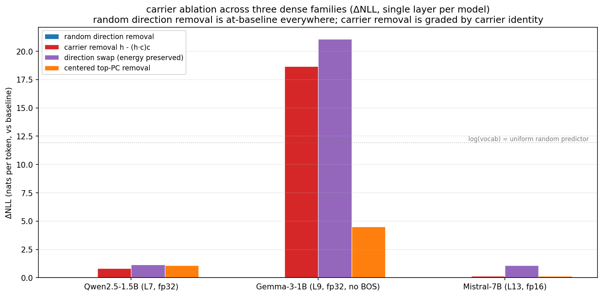

# Causal Ablation: Carriers Are Load-Bearing on Three Dense Families

**Status (2026-04-30 → 2026-05-03):** Forward-pass intervention test on Qwen2.5-1.5B (full layer sweep, fp32), Gemma-3-1B (full layer sweep, fp32, both no-BOS and +BOS), and Mistral-7B-Instruct-v0.3 (single layer L13, fp16, single-layer due to compute). Plus sanity checks on Gemma at L9 (`hook_noop`, `norm_restored`).

The headline updates the structural story from the cross-model writeup: **persistent residual-stream carriers are causally load-bearing, and carrier identity changes the failure mode**. Random direction removal is at-baseline everywhere. Carrier removal is graded by carrier identity. Direction swap is consistently worse than removal — the model expects information in a specific direction; wrong-direction energy is adversarially malformed state.

This is a causal follow-up to the structural cross-model write at `docs/layer_structure_carrier_cross_model.md`. Code: `scripts/ablate_carrier.py`. Outputs: `results/ablation_*.json`. Figures: `docs/img/ablation_*.png`.

---

## Setup

For each model: load checkpoint, compute carrier direction `c` from the matching `carrier_structure_*.npz` (top-1 right singular vector of stacked uncentered middle-band activations), use the same wikitext token sequences saved during the carrier analysis, and intervene with a forward hook on the residual stream between transformer blocks.

Five conditions per target layer:

1. **baseline** — no hook
2. **carrier_remove**: `h ← h - (h · c) c`
3. **random_remove**: `h ← h - (h · r) r`, `r` random unit, averaged over 8 (Qwen) / 16 (Gemma) / 8 (Mistral) seeds
4. **direction_swap**: `h ← h - (h · c) c + (h · c) r`, `r ⊥ c` random unit, same seed counts. Preserves carrier coefficient magnitude but redirects to a random orthogonal direction.
5. **centered_remove**: `h ← h - (h · c_c) c_c` where `c_c` is the sign-aligned mean of per-layer top *centered* eigenvectors across the collapsed band.

Two extra sanity conditions (Gemma L9 only):

- **hook_noop**: hook returns input unchanged. Sanity check that the hook machinery itself does not perturb the residual stream.
- **norm_restored**: project off carrier and rescale per-position to original `||h||`. Disambiguates "model needed the carrier signal" from "model needed the correct ||h|| fed to the next layer's RMSNorm".

Response: per-token NLL via standard next-token cross-entropy on each model's saved 8 × 512 wikitext sequences. We report ΔNLL (nats per token, vs baseline) as the primary unit and PPL ratio as secondary intuition. PPL ratios become unstable once a model is broken; ΔNLL stays interpretable.

## Cross-model results

Baseline PPLs (and NLLs):

- Qwen2.5-1.5B: 12.51 PPL (NLL 2.53)
- Gemma-3-1B (no BOS): 57.94 PPL (NLL 4.06)
- Gemma-3-1B (+BOS): 39.99 PPL (NLL 3.69)
- Mistral-7B (fp16): 8.18 PPL (NLL 2.10)

Per-condition ΔNLL (nats per token):

| Model · Layer | random_remove | carrier_remove | direction_swap | centered_remove |
|---|---:|---:|---:|---:|
| **Qwen L7**          | (n/a)\* | +0.83 | +1.15\*\* | +1.08 |
| Qwen L13             | (n/a)\* | +0.42 | +0.55\*\* | +0.41 |
| Qwen L20             | (n/a)\* | +0.15 | +0.21\*\* | +0.17 |
| **Gemma L9 (no BOS)** | +0.05 | **+18.67** | **+21.07** | +4.50 |
| Gemma L14 (no BOS)   | +0.02 | +18.04 | +25.08 | +5.48 |
| Gemma L19 (no BOS)   | +0.01 | +5.14 | +23.37 | +2.72 |
| Gemma L9 (+BOS)      | +0.03 | **+19.82** | **+21.28** | +10.73 |
| Gemma L14 (+BOS)     | +0.03 | +18.57 | +25.50 | +25.88 |
| Gemma L19 (+BOS)     | +0.01 | +5.17 | +22.89 | +21.77 |
| **Mistral L13 (fp16)** | +0.00 | +0.16 | +1.09 | +0.15 |

\*  Qwen ablation reported `ppl_mean`/`ppl_std` not median; band gap is sub-0.01 nats and effectively at-baseline.
\*\* Qwen direction-swap is mean-only with high variance (3.20× ± 7.4 PPL at L7); reported nats here use the mean, not median.

## What this tells us

### 1. Random direction removal is at-baseline on every model.
Across Qwen, Gemma, Mistral, ΔNLL for random direction removal stays under 0.05 nats — well within sequence-to-sequence noise. So the carrier-removal damage is direction-specific, not "any direction matters". Same conclusion as the Qwen-only run, now confirmed on three families.

### 2. Carrier identity governs the magnitude of the failure.

| Carrier identity | Example model | Carrier removal ΔNLL | Reading |
|---|---|---:|---|
| dark/sink-style, rank-1 | Qwen L7 | +0.83 | model degrades but stays coherent |
| dark/sink-style, rank-2/3 | Mistral L13 | +0.16 | rank-1 alone is incomplete; partial breakage |
| bright/distributed, rank-1 | Gemma L9 | **+18.67** | model goes off-scale, *worse than uniform random* |

Mistral's carrier is genuinely 2-3 dimensional (top-1 captures only 84% of stacked variance vs 98% for Qwen and Gemma). Removing only the rank-1 component leaves the rank-2 carrier component still in place, which explains why the rank-1 removal effect is mild on Mistral — the rest of the carrier subspace is still doing its job. To break Mistral's carrier fully we'd need rank-2 or rank-3 ablation, not rank-1.

The Gemma effect deserves emphasis: log(vocab_size) ≈ 12.4 nats on Gemma is the worst possible NLL under uniform-random next-token prediction. Carrier removal pushes Gemma to ΔNLL = +18.7 nats (mean NLL ≈ 22.7 vs baseline 4.06), which is 6+ nats *above* the uniform-random ceiling. The model isn't just losing predictive power — it's actively assigning probability mass *away* from the true tokens. Removing the bright carrier leaves the unembedding reading from a destroyed signal, and the resulting logits are confidently wrong.

### 3. Direction matters, not just energy.

direction_swap (which preserves carrier coefficient magnitude but rotates it into a random orthogonal direction) is **consistently worse than carrier removal** across every model and target layer:

- Qwen L7: swap +1.15 vs remove +0.83 (gap +0.32 nats)
- Gemma L9 no-BOS: swap +21.07 vs remove +18.67 (gap +2.40)
- Mistral L13 fp16: swap +1.09 vs remove +0.16 (gap +0.93)

The model isn't just affected by losing the carrier's energy mass; it's specifically affected by having that energy redirected to a random direction. Downstream layers must be actively reading the carrier direction in a way that's broken by injected noise. Roughly: the model expects the carrier coefficient to encode something specific; replacing that with random-direction noise creates active interference, not just lost signal.

This is the strongest evidence yet that the carrier is *information* the model has built around, not just a numerical drift it learned to subtract.

### 4. Effect decays with depth in both Qwen and Gemma.
Earlier middle layers matter more than later middle layers. L7 / L9 > L13 / L14 > L19 / L20 monotonically in both models (sweeping target layers). The carrier is structural infrastructure that downstream layers depend on; the deeper into the stack you intervene, the fewer downstream layers are left to break.

### 5. Centered top-PC is a separate story per family.
On Qwen, `centered_remove` tracks `carrier_remove` because the uncentered and centered top eigenvectors are the same direction (alignment 1.0000 — the BOS sink dominates both). On Gemma, the alignment is 0.9832; `centered_remove` is much milder than `carrier_remove` in the no-BOS run (4.5 vs 18.7 nats at L9) but escalates to comparable magnitude with BOS (10.7 vs 19.8 at L9; 25.9 vs 18.6 at L14). On Mistral, centered_remove tracks carrier_remove (alignment 0.9997, partial-rank issue applies the same way).

So whether the centered top-PC is a separate critical direction depends on how much the dominant-mean component differs from the dominant-variance component for each model. With BOS prepended, this difference grows on Gemma.

## Sanity checks (Gemma L9, fp32)

| condition | PPL | ΔNLL | reading |
|---|---:|---:|---|
| baseline (no hook) | 57.9389 | 0.00 | reference |
| **hook_noop** | **57.9389** | **+0.0000** | **hook machinery is innocent** |
| carrier_remove | 7.5e9 | +18.67 | catastrophic, as before |
| **norm_restored** | **3.3e16** | **+33.97** | **even more catastrophic than plain removal** |

Two things this rules out:

- **Hook artifact**: hook_noop returns identical PPL to no-hook baseline. The intervention's effect is from the projection, not from the hook machinery (dtype casts, output unpacking, etc).
- **Norm-mismatch confound**: norm_restored projects off the carrier and *rescales* per-position to recover the original `||h||`. If the failure was just "next layer's RMSNorm sees the wrong norm", restoring norm should recover most of the performance. It does the opposite. ΔNLL goes from +18.7 (carrier_remove) to +34.0 (norm_restored). Filling the lost carrier-direction norm into the perpendicular subspace creates more interference, not less. The failure is about *what's in* the carrier direction, not the norm magnitude.

Combined: the carrier signal itself is the load-bearing component, and downstream layers cannot be tricked by simply preserving the residual norm. They are reading the specific direction's coefficient as content.

## What we can claim, what we can't

**Claims supported by the data:**

> Persistent residual-stream carriers are causally load-bearing across the three dense families we tested (Qwen, Gemma, Mistral). Random direction removal is at-baseline. Carrier removal scales by carrier identity: dark/sink-style carriers (Qwen, Mistral) cause moderate degradation; the bright-aligned carrier in Gemma causes catastrophic failure that goes beyond uniform-random prediction. Direction swap is uniformly worse than removal. The hook machinery is innocent and the failure is not driven by norm mismatch.

**Claims NOT supported (would need more work):**

- *Universal generalization.* Three families is a real cross-family test but doesn't reach hybrid/MoE/Llama. Cancedda 2024 covered LLaMa2 dark-signal sinks; we extended to Qwen and Mistral (sink-style replication) and Gemma (bright counterexample). Llama-3, hybrid models, MoE all untested.
- *Mistral rank-2 ablation.* Single rank-1 removal at one layer (L13) is enough to confirm the qualitative pattern but understates Mistral's carrier-importance. Multi-rank or full-band intervention would tighten the story.
- *Bright vs dark mechanism.* We have a pattern but no mechanistic theory for *why* bright carriers fail more catastrophically than dark sinks. Sketch (not data): bright carriers are read by the unembedding directly, so removing them breaks the path to logits; dark sinks support attention transport, so removing them degrades attention but logit production has partial routes left.
- *Gemma "bright carrier" identity.* The carrier exists, is persistent, is bright-aligned, and is causally critical. What it *encodes* is unknown.
- *Norm-restored result on Mistral / Qwen.* Sanity checks were Gemma-only. The conclusion that norm preservation doesn't help may be Gemma-specific — different carrier types might respond differently to norm restoration. Testing on Qwen would tighten this.

## Limits

- **Compute budget**: Mistral fp32 ablation was infeasible on M5 Max (~21 hours estimated). Switched to fp16 forward at single target layer L13. The carrier direction was computed in fp32 and projected onto fp16 activations; the random-remove control stays at-baseline confirming there's no precision artifact in the random direction.
- **Wikitext only**: domain effects untested. NIAH-style retrieval would be a more demanding response measure.
- **Single-layer interventions**: multi-layer ablation might compound. Untested.
- **Single carrier rank**: rank-1 carrier on Mistral underrepresents the full carrier subspace (top-1 = 84% of variance). The 1.17× PPL effect on Mistral is a lower bound on the full carrier's importance.

## Where this lands

The carrier story now has both halves cleanly:

- **Structural** (cross-model writeup): persistent low-rank carriers exist in three dense families, with different identities (dark/sink vs bright/distributed). Adjacent-layer cosine and CKA both have carrier-dependent failure modes.
- **Causal** (this writeup): the carriers are load-bearing infrastructure, regardless of identity. The failure mode (mild vs catastrophic) is governed by carrier type, not by whether the carrier matters at all. Specific direction matters, not just energy.

This upgrades the public-facing claim from "metric critique with structural decomposition" to **persistent residual-stream carriers are real causal infrastructure that adjacent-layer cosine flattens**.

## Adjacency

This is the final causal piece of the layer-structure work that started with [Muyu He's thread](https://x.com/HeMuyu0327/status/2048615865222938972) on adjacent-layer cosine. It's independent from the K/V asymmetry memo and uses the same toolkit on a different object.
