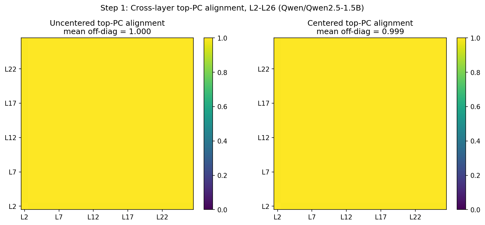
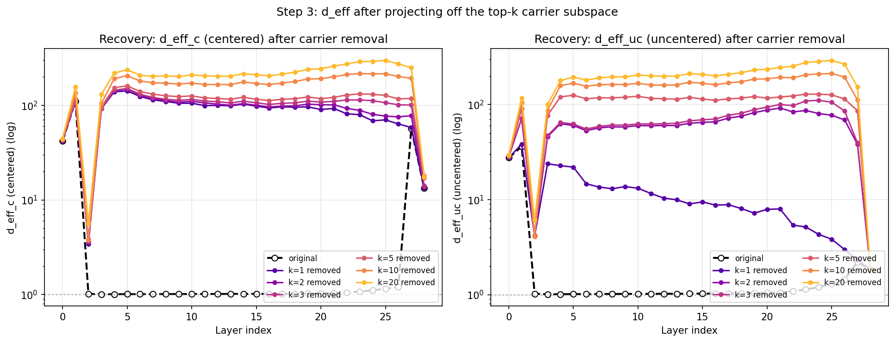
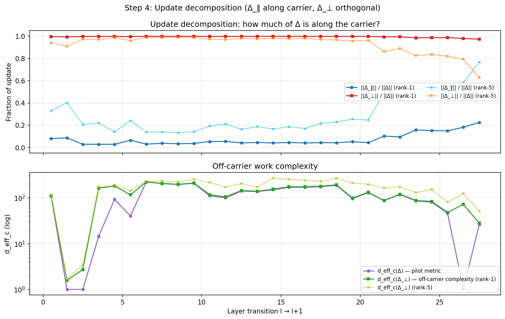
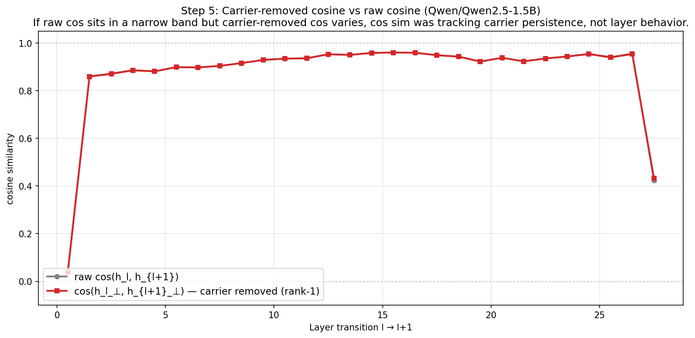
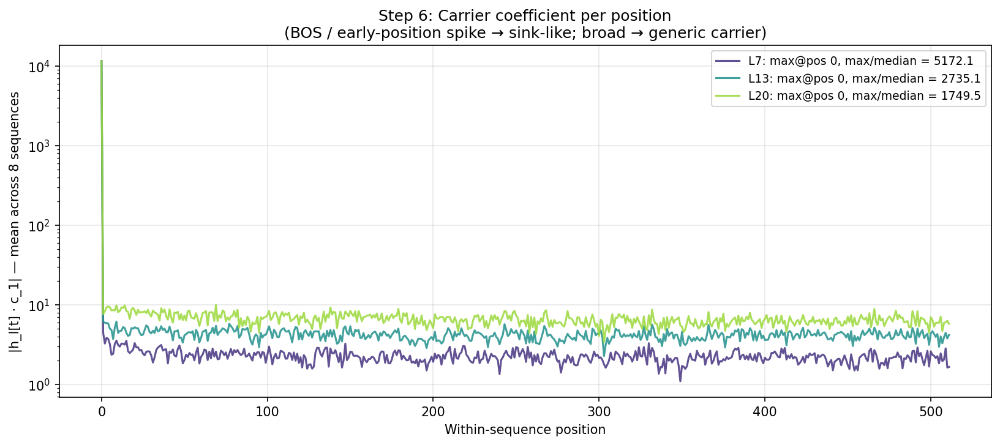

# Carrier Decomposition: Mechanism Test for the Layer-Structure Pilot

**Status (2026-04-25):** Phase-2 follow-up to `docs/layer_structure_pilot.md`. Six tests run on Qwen2.5-1.5B in fp32. The carrier hypothesis is confirmed cleanly. One predicted result did not show up — see §5 — and the implication is sharper for it.

---

## Headline (one paragraph)

The middle 25 layers of Qwen2.5-1.5B's residual stream are dominated by a **single, persistent direction** that captures **97.85% of variance** in the stacked L2–L26 activations. Cross-layer top-PC alignment is 0.9995. That direction is the **BOS attention sink**: max/median ratio of the carrier coefficient is 5172 at L7, and peaks at position 0 in every middle layer we checked. After projecting off this single direction, per-layer `d_eff_c` jumps from ~1 to **70–140** — confirming that "rich variance was always there, just hidden under the carrier." Layer updates are **97–99% perpendicular** to the carrier, so the model's actual computation happens in the off-carrier subspace and not in the carrier direction itself. **One predicted finding did not show up:** carrier-removed cosine barely moves at rank-1. This is informative — see §5.

## Setup

- Model: Qwen2.5-1.5B
- Calibration: 8 wikitext sequences × 512 tokens, **fp32 forward** (was fp16 in the pilot)
- Code: `scripts/analyze_carrier_structure.py`, `scripts/plot_carrier_structure.py`
- Raw output: `results/carrier_structure_qwen25_1.5b.json`, `.npz` for the carrier basis
- Figures: `docs/img/carrier_*.png`

## 1. Persistence: do per-layer top PCs align?

| | mean off-diag |
|---|---:|
| Uncentered top-PC, L2–L26 | **0.9995** |
| Uncentered top-PC, L3–L25 | 0.9999 |
| Centered top-PC, L2–L26 | 0.9995 |
| Centered top-PC, L3–L25 | 0.9999 |

The heatmaps are uniformly yellow. Every middle layer's top PC points in essentially the same direction as every other middle layer's top PC. Centered and uncentered definitions agree completely.

**The "stable carrier" hypothesis isn't a fit — it's effectively exact.** No need to fall back to the "rotates slowly" or "multiple carriers" branches of our pre-registered decision tree.

## 2. Carrier basis

- Top-1 right singular vector of stacked L2–L26 uncentered activations explains **97.85%** of variance among the top-50 components.
- Top-2: 99.22%. Top-5: 99.41%. Top-20: 99.76%.
- Sign-aligned mean of per-layer top-1 PCs has alignment **1.0000** to the stacked top-1.

The carrier is essentially **rank-1**. The top-2 contribution adds 1.4 percentage points; everything beyond is noise. Whatever this direction is, it doesn't have a meaningful "second" companion.

## 3. Recovery: d_eff_c after carrier removal

Cleanest result of the pass. Original middle-layer `d_eff_c` is ~1.0. After removing **just the rank-1 carrier**:

| Layer | original d_eff_c | k=1 removed | k=5 removed | k=20 removed |
|---:|---:|---:|---:|---:|
| L3 | 1.01 | **91.6** | 95.7 | 129.9 |
| L4 | 1.01 | **138.7** | 153.5 | 218.7 |
| L7 | 1.01 | **113.9** | 130.9 | 202.2 |
| L13 | 1.02 | **98.6** | 115.8 | 202.9 |
| L20 | 1.03 | **90.1** | 117.1 | 243.2 |
| L26 | 1.20 | **63.4** | 116.5 | 273.2 |

**The collapsed-1D appearance was driven by a single direction.** Take it out and middle layers reveal `d_eff_c` of **70–140**. Most of the further recovery up to k=20 is incremental.

**One exception**: L2 is special. Even with top-20 removed, its `d_eff_c` only reaches 5.67. L2 appears to be the layer where the collapse is *created* — its representation is genuinely low-rank in a way the others aren't. Worth flagging as a one-layer anomaly.

L0, L1, L27, L28 (non-collapsed regimes) are essentially unchanged by carrier removal — the carrier is not a major direction in those layers' activations. This is the right behavior and a useful sanity check.

## 4. Update decomposition

For every transition `l → l+1`, decompose `Δ = h_{l+1} - h_l` into carrier-aligned (`Δ_∥`) and orthogonal (`Δ_⊥`) components.

- `||Δ_∥|| / ||Δ||` is **3–22%** across all transitions (rank-1 carrier).
- `||Δ_⊥|| / ||Δ||` is **97–99%**.
- `d_eff_c(Δ_⊥)` reproduces the pilot's `d_eff_c(Δ)` variation (~1 to 220) — same 200× range, just measured on the off-carrier component instead of the full Δ.

**Layer updates are overwhelmingly perpendicular to the carrier.** The model is not doing its work by writing into the carrier direction. The carrier is structural infrastructure (almost certainly the sink — see §6), and the layers compute in the perpendicular subspace alongside it.

The pilot's headline disagreement (L2→3 with `d_eff_c(Δ)≈1` vs L7→8 with `d_eff_c(Δ)≈204`) survives intact: now we can say it's **off-carrier work complexity** that varies, not something dominated by carrier maintenance.

## 5. Carrier-removed cosine: the surprise

We predicted that removing the carrier from `h_l` and `h_{l+1}` would unflatten the cosine — that the apparent "narrow 0.85–0.96 band" was an artifact of carrier persistence, and removing it would reveal underlying variation.

**It does not.** Raw `cos(h_l, h_{l+1})` and carrier-removed `cos(h_l_⊥, h_{l+1}_⊥)` differ by less than 0.002 on every middle-layer transition. The two curves are essentially identical.

This is informative, not a failure. It means **adjacent perpendicular components also point in coherent per-token directions across layers**, not just the carrier. The token-specific off-carrier content is preserved layer-to-layer with similar fidelity to the sink itself.

So cos sim isn't *just* tracking the carrier. It's tracking carrier-plus-perpendicular structure that also happens to persist.

The downstream conclusion is sharper: **cos sim is the wrong tool for measuring layer behavior, and it cannot be patched by carrier subtraction**. The right tools are spectrum-of-variance metrics (`d_eff` on activations or updates) that ask "how concentrated is the across-position variance?" rather than "how aligned are corresponding tokens?"

This is closer to Muyu's critique #2 (direction-blindness) than #3 (norm-domination). Cosine is direction-aligned per-token; per-token directions can be preserved across layers even when the *aggregate variance structure* changes wildly. d_eff sees the latter; cos sim cannot.

## 6. Position localization: the carrier is the BOS attention sink

| Layer | Max-position | max / median |
|---|---:|---:|
| L7 | **0** (BOS) | **5172** |
| L13 | **0** (BOS) | **2735** |
| L20 | **0** (BOS) | **1749** |

The plot is dramatic. Position 0 (BOS) sits ~10⁴ in carrier coefficient; every other position sits at ~1–10. **Three orders of magnitude separation.** Across all three sampled middle layers, the carrier coefficient peaks at position 0.

This matches the StreamingLLM / massive-activations literature exactly. The "carrier" is a **single channel direction that BOS uses to absorb attention mass that would otherwise be forced onto content tokens by softmax**. The model maintains and amplifies this channel through all 25 middle layers because removing it would force every attention head to redistribute mass to content tokens, breaking computation.

## What we now know

1. **The carrier is rank-1.** 97.85% of stacked variance, 0.9995 cross-layer alignment.
2. **The carrier is the BOS attention sink.** Confirmed by position localization.
3. **The 1D-collapse was a measurement artifact, not a real low-rank representation.** d_eff_c jumps to 70–140 after rank-1 removal. The model has rich representational structure throughout the residual stream; the structure was just hidden under one giant direction.
4. **Layer updates compute in the perpendicular subspace.** 97–99% of every Δ is off-carrier.
5. **Cos sim cannot be saved by carrier removal.** It also tracks per-token perpendicular alignment, which persists too.
6. **L2 is anomalous.** Genuinely low-rank even after carrier removal. Possibly the layer that creates the collapse. Worth a separate look.

## What this is (and isn't) a contribution

**Concrete contributions:**
- Direct empirical confirmation that the L2–L26 d_eff~=1 collapse in Qwen2.5-1.5B is dominated by a single persistent direction.
- That direction is unambiguously the BOS attention sink (max/median ratio in the thousands).
- A practical implication: spectral / variance-based metrics (d_eff, participation ratio on Δ) reveal layer behavior that per-token cosine cannot, *even with carrier subtraction*. This is a sharper version of Muyu's #2 critique than the original pilot established.
- A clean negative on the "carrier-removed cosine" hypothesis: removing the carrier doesn't fix cos sim. Cos sim is not the right tool for this question.

**What this is not:**
- A general theory of layer utility.
- A claim that all transformers have this exact carrier (almost certainly Qwen-specific levels, but the *phenomenon* — sink direction with massive activations — is documented across families).
- Evidence about what the model is computing in the perpendicular subspace. We measured the spectrum's complexity, not its content.

## Limits

- One model. Generalization untested.
- 8 × 512 = 4096 positions. Stable for spectrum-level claims, fine for position localization. Not enough for per-position behavioral claims.
- Carrier definition: stacked uncentered top-1. Centered top-1 agrees (0.9995 alignment), so this isn't a fragile definitional choice on this model.
- Some `d_eff_c(Δ_⊥)` values approach the dimensionality limit (~290 out of 1536). At that density the metric is partially measuring "spread" rather than "structure." Not load-bearing for the headline.

## Adjacency

This builds on `docs/layer_structure_pilot.md`. It does not connect to `docs/kv_asymmetry_memo.md` or the Bench A K/V work — same toolkit, different object. The carrier we identified here is in residual-stream activation space, not in K or V projection space.

## Where this could go (not committed)

If we wanted to make this a more durable contribution rather than a working note:

1. **Reproduce on 2–3 more dense models** (Mistral-7B, Gemma-3, Llama variant). Tests whether the BOS-sink carrier is universal or Qwen-flavored. Would take ~1 hour each, no new code.
2. **Probe what the perpendicular subspace encodes.** That's mech-interp work — token-specific projections, position effects, etc. Different project.
3. **Test the L2 anomaly directly.** Why does only L2 stay genuinely low-rank after carrier removal? Plausibly: it's the layer that creates the sink, and its activation is structurally tied to sink construction.

None of these are scheduled.
